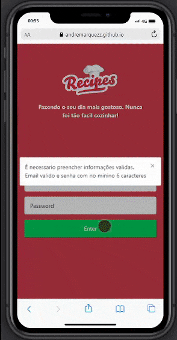

# 🚧 README em construção 🚧

   

<h1 align="center">Aplicativo de Receitas</h1>
<p align="center">Aplicativo onde é possivel ver, buscar, filtrar, favoritar e acompanhar o progresso de preparação de receitas e drinks!</p>
<p align="center"> 
  
 </p>

# Sumário

• [Sobre o Projeto](#-sobre-o-projeto)

• [Tecnologias utilizadas no desenvolvimento do projeto](#-tecnologias-utilizadas-no-desenvolvimento-do-projeto)

- [Como executar o projeto](#-como-executar-o-projeto)
  - [Remotamente](#remotamente)
  - [Localmente](#localmente)
- [Contribuidores](#-contribuidores)

### 💻 Sobre o Projeto

<p>Um aplicativo de receitas que tem como base de dados 2 APIs distintas, uma para comidas e outra para bebidas. No aplicativo é possível ver, buscar, filtrar, favoritar e acompanhar o progresso de preparação de receitas e drinks, onde caso o usuário saia é possivel continuar a receita do mesmo ponto onde foi pausada, para o desenvolvimento da aplicação foi utilizado tecnologias como ReactJS, Redux Tool Kit, React Hooks, o método Kanban em conjunto com a ferramenta trello e o layout foi construido no figma e tem como foco dispositivos móveis, durante o desenvolvimento foi utilizado a resolução 360 x 640/p>

 </p>

### 🛠 Tecnologias utilizadas no desenvolvimento do projeto

- **[React](https://github.com/facebook/react)**
- **[React Router Dom](https://github.com/ReactTraining/react-router/tree/master/packages/react-router-dom)**
- **[Redux Tool Kit](https://redux-toolkit.js.org/)**
- **[Jest](https://github.com/facebook/jest#-delightful-javascript-testing)**
  > Veja o arquivo [package.json](https://github.com/andremarquezz/ProjetoAppReceitas/blob/main/package.json)

# 🚀 Como executar o projeto

### Remotamente

_Copie a URL abaixo e cole no seu navegador_

```jsx
https://andremarquezz.github.io/ProjetoAppReceitas/#/
```

### Localmente

_Pré-requisitos_

Antes de começar, você vai precisar ter instalado em sua máquina as seguintes ferramentas:
[Git](https://git-scm.com), [Node.js](https://nodejs.org/en/).
Além disto é bom ter um editor para trabalhar com o código como [VSCode](https://code.visualstudio.com/)

_1- Clonar o repositorio_

```jsx
git@github.com:andremarquezz/ProjetoAppReceitas.git
```

_2- Executar o comando abaixo no terminal, dentro da pasta do projeto._

```jsx
npm install
```

_3- Executar o comando abaixo no terminal, dentro da pasta do projeto._

```jsx
npm start
```
*A aplicação contém testes, para executar basta digitar o comando abaixo no terminal, dentro da pasta do projeto.  -Em Progresso* 
```jsx 
npm test
```

# 👨‍💻 Contribuidores

💜 Um super obrigado para esse equipe que em união fizemos esse projeto sair do campo da ideia.

*Diego Santos*, *Anthony Cruz*, *Pedro Reis* e *Gabriel Rodrigues*.
